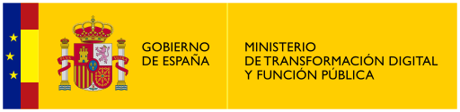

What is INESData?
An incubator of data spaces and AI services at the national level using federated infrastructures in the Cloud.

For more information, consult the guide to [INESData Data Spaces](https://inesdata-project.eu/content/en/guide.html).

# About the repository

This repository will house the resources, code, and libraries used and/or developed in the project.

# Acknowledgments

Este trabajo ha recibido financiación del proyecto INESData (Infraestructura para la INvestigación de ESpacios de DAtos distribuidos en UPM-TSI-063100-2022-0001), un proyecto financiado en el contexto de la convocatoria UNICO I+D CLOUD del Ministerio para la Transformación Digital y de la Función Pública en el marco del PRTR financiado por Unión Europea (NextGenerationEU)

inesdata4.png

ministerio-logo.png
nextgeneration-logo.png
unico-logo.png

  
  &nbsp;&nbsp;&nbsp;
  
  &nbsp;&nbsp;&nbsp;
  
  &nbsp;&nbsp;&nbsp;
  

